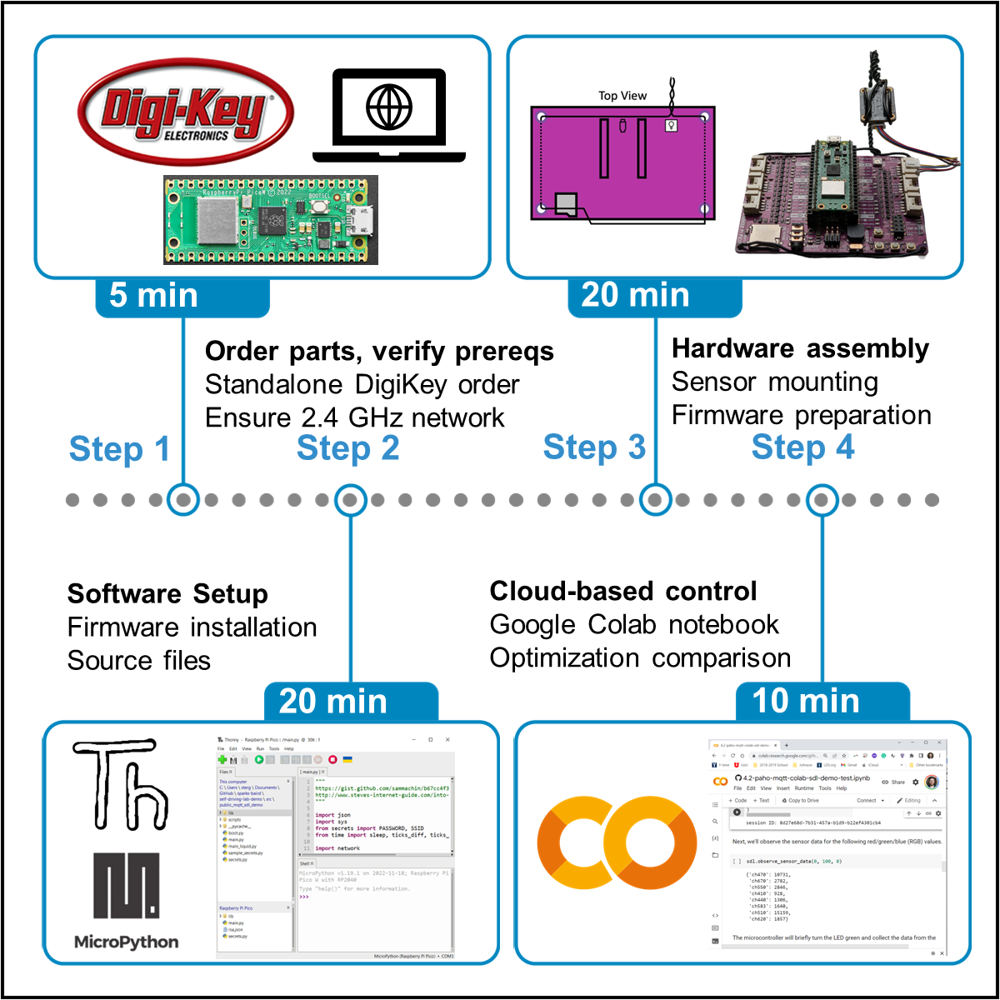
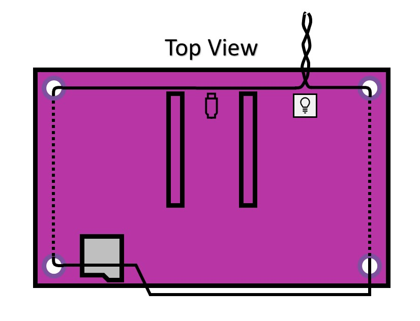
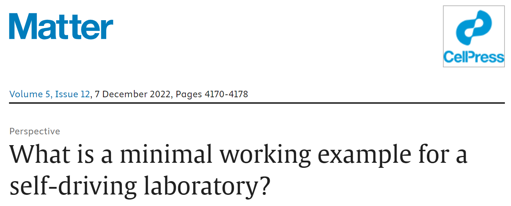

# 🧩 1.1 Run the Demo

% ```{rubric} 🧩 1.1 Run the Demo
% ```

```{contents}
:depth: 3
```

## 🔰 Tutorial

Learn how to build a Closed-loop Spectroscopy Lab: Light-mixing Demo (CLSLab:Light) to
perform color matching via RGB LEDs and a light sensor for under 100 USD and less than an hour
of setup. The tutorial covers ordering parts, verifying prerequisites, software setup, sensor
mounting, testing, and an optimization algorithm comparison tutorial. We use secure IoT-style
communication via MQTT, MicroPython firmware on a pre-soldered Pico W microcontroller, and
the self-driving-lab-demo Python package.



*Setting up the CLSLab:Light "Hello World" demo. The workflow takes approximately one hour to complete using pre-made software components. Licensed under CC-BY license from:  [10.1016/j.xpro.2023.102329](https://doi.org/10.1016/j.xpro.2023.102329)*

### Hardware and WiFi Requirements

```{include} ./hardware-note.md
```

### Video Tutorial

✅ Follow the [video tutorial](https://youtu.be/D54yfxRSY6s) below. Consider printing a hardcopy of the [Build Instructions manuscript](https://doi.org/10.1016/j.xpro.2023.102329) or opening it in a separate tab.

```{warning}
You must copy [the `hivemq-com-chain.der` file](https://raw.githubusercontent.com/sparks-baird/self-driving-lab-demo/main/src/public_mqtt_sdl_demo/hivemq-com-chain.der) to the Pico W for it to work with recent version of the `self-driving-lab-demo` package. If you swapped out the credentials with your own broker information (required for the assignment), you must [generate your own `hivemq-com-chain.der` file](https://colab.research.google.com/github/sparks-baird/self-driving-lab-demo/blob/main/notebooks/7.2.1-hivemq-openssl-certificate.ipynb) due to a recent change in HiveMQ's security procedures (as of 2024-07-03).
```

<iframe width="560" height="315" src="https://www.youtube.com/embed/D54yfxRSY6s?si=xB5bo7bxWry02q5Q" title="YouTube video player" frameborder="0" allow="accelerometer; autoplay; clipboard-write; encrypted-media; gyroscope; picture-in-picture; web-share" allowfullscreen></iframe>

Figure 3 from the build instruction manuscript is copied below for convenience:

<!--  -->



```{tip}
While Thonny makes it very easy to install MicroPython and provides a beginner-friendly integrated development environment (IDE), users may prefer to use [the MicroPico extension](https://marketplace.visualstudio.com/items?itemName=paulober.pico-w-go) in VS Code for actual code development after installing MicroPython via Thonny or through [the corresponding UF2 file](https://www.raspberrypi.com/documentation/microcontrollers/micropython.html). Combined with cloning your GitHub assignment repo locally, this can allow for a very streamlined experience. While the MicroPico extension is overall very nice, sometimes it can be more finicky than Thonny. If you run into issues, one troubleshooting step you may take is to check against how it runs in Thonny.
```

### Additional Resources

For some additional context about the motivation of these demos, read *What is a minimal working example for a self-driving laboratory?* at [🔗 DOI: 10.1016/j.matt.2022.11.007](https://doi.org/10.1016/j.matt.2022.11.007) or by clicking the image below:

[](https://doi.org/10.1016/j.matt.2022.11.007)

```{note}
A static PDF copy is also [available at `ac-microcourses`](https://github.com/AccelerationConsortium/ac-microcourses/raw/main/docs/courses/hello-world/pdf/baird_what_2022.pdf)
```

## 🚀 Quiz

::::{tab-set}
:sync-group: category

:::{tab-item} W 2024
:sync: w2024

https://q.utoronto.ca/courses/350933/assignments/1274172?display=full_width
:::

:::{tab-item} Sp/Su 2024
:sync: sp2024

https://q.utoronto.ca/courses/351407/assignments/1286925?display=full_width
:::

:::{tab-item} Sp/Su 2025
:sync: sp2025

https://q.utoronto.ca/courses/367721/assignments/1499670?display=full_width_with_nav
:::

::::

## 📄 Assignment

A partial walkthrough of the assignment is shown below. If you get stuck, refer back to the build instructions manuscript and the [AC Microcourses Hello World GitHub discussions](https://github.com/AccelerationConsortium/ac-microcourses/discussions/categories/hello-world).

<video width="700" height="394" controls>
  <source src="../../_static/run-the-demo-walkthrough.mp4" type="video/mp4">
  Your browser does not support the video tag.
</video>

::::{tab-set}
:sync-group: category

:::{tab-item} W 2024
:sync: w2024

https://q.utoronto.ca/courses/350933/assignments/1274173?display=full_width
:::

:::{tab-item} Sp/Su 2024
:sync: sp2024

https://q.utoronto.ca/courses/351407/assignments/1286926?display=full_width
:::

:::{tab-item} Sp/Su 2025
:sync: sp2025

https://q.utoronto.ca/courses/367721/assignments/1499669?display=full_width_with_nav
:::

::::
