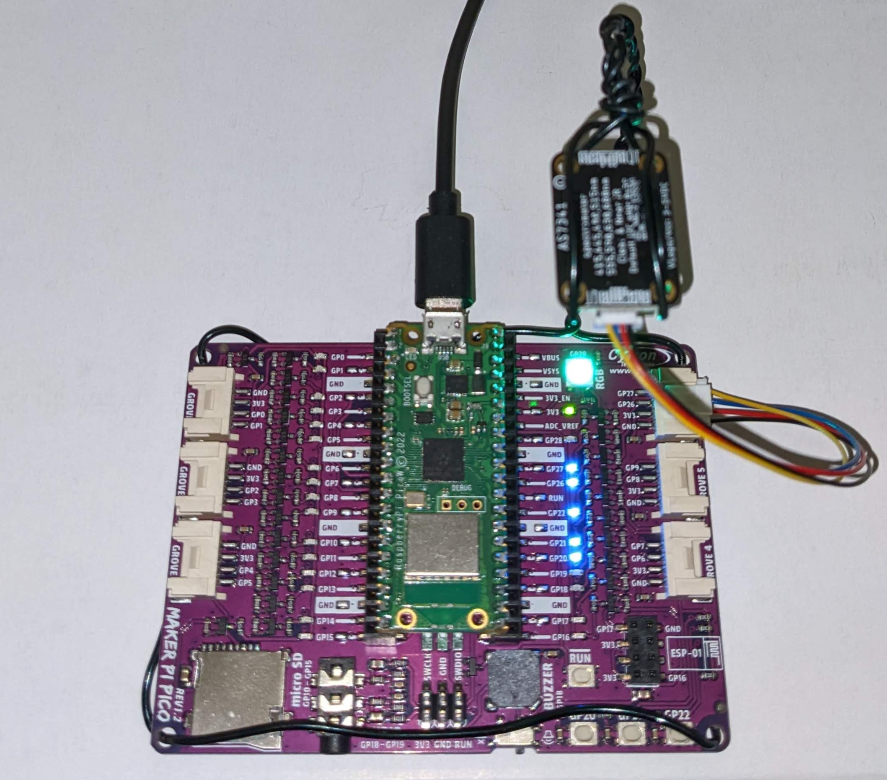
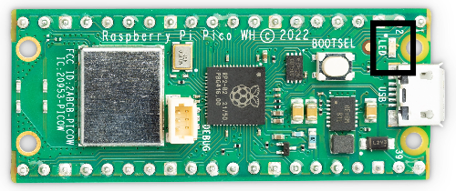

# 🧩 1.2 Blink and Read

% ```{rubric} 🧩 1.2 Blink and Read
% ```

```{contents}
:depth: 2
```

## 🔰 Tutorial

Learn how to write MicroPython scripts and use a Raspberry Pico W microcontroller to send commands to an RGB LED and read data from a light sensor.



*Flashing the RGB LED on the Maker Pi Pico base with a green color.*

### Getting Started with the Pico (Optional)

<details>
<summary>📚 Key Concepts from Getting Started Guide</summary>

1. **Basic Pico W Setup**
   ```python
   # Essential imports
   from machine import Pin
   from time import sleep
   
   # LED setup
   led = Pin("LED", Pin.OUT)
   ```

2. **Common Pin Functions**
   - `Pin.OUT`: Set pin as output
   - `Pin.IN`: Set pin as input
   - `Pin.PULL_UP`: Enable internal pull-up resistor
   - `Pin.PULL_DOWN`: Enable internal pull-down resistor

3. **Quick Reference**
   ```python
   # Turn LED on/off
   led.value(1)  # On
   led.value(0)  # Off
   
   # Toggle LED
   led.toggle()
   ```

4. **Pin Mapping**
   
</details>

<details>
<summary>🔧 Common Setup Issues & Solutions</summary>

1. **MicroPython Installation**
   - Download latest firmware from official site
   - Hold BOOTSEL while connecting
   - Drag UF2 file to RPI-RP2 drive

2. **Connection Problems**
   - Check USB cable
   - Verify COM port in Device Manager
   - Try different USB ports

3. **Code Upload Issues**
   - Use Thonny's "Stop" button first
   - Check for syntax errors
   - Verify file saved as .py
</details>

### 💡 Learning Checkpoint 1: Onboard LED

The script in this section controls the onboard LED (see black callout below).



```python
from time import sleep
from machine import Pin

onboard_led = Pin("LED", Pin.OUT)  # Pico W is slightly different than Pico

while True:
    onboard_led.toggle()
    sleep(2)
```

<details>
<summary>🔍 Try This!</summary>

Modify the code to:
1. Make the LED blink faster (0.5 seconds)
2. Create a custom blink pattern (e.g., short-short-long)
3. Add a counter to stop after 10 blinks

Here's a template to get started:
```python
from time import sleep
from machine import Pin

def custom_blink(led, pattern):
    """
    led: Pin object
    pattern: list of tuples (state, duration)
    """
    for state, duration in pattern:
        led.value(state)
        sleep(duration)
```
</details>

### 💡 Learning Checkpoint 2: Temperature Sensor

```python
import machine

def read_temperature():
    """Read and return the Pico's temperature in Celsius"""
    sensor = machine.ADC(4)
    adc_value = sensor.read_u16()
    volt = (3.3 / 65535) * adc_value
    temperature = 27 - (volt - 0.706) / 0.001721
    return round(temperature, 1)

# Example usage with error handling
try:
    temp = read_temperature()
    print(f"Current temperature: {temp}°C")
except Exception as e:
    print(f"Error reading temperature: {e}")
```

<details>
<summary>🎯 Mini Quiz: Temperature Sensor</summary>

1. Why do we use `ADC(4)` for temperature?
   <details>
   <summary>Answer</summary>
   Pin 4 is connected to the Pico's internal temperature sensor
   </details>

2. What's the purpose of the voltage conversion?
   <details>
   <summary>Answer</summary>
   To convert the raw ADC reading (0-65535) to actual voltage (0-3.3V)
   </details>
</details>

### 🛠️ Useful Functions for LED Control

```python
def rainbow_cycle(np):
    """Demo of advanced LED control"""
    import time
    
    def wheel(pos):
        # Input a value 0 to 255 to get a color value.
        if pos < 0 or pos > 255:
            return (0, 0, 0)
        if pos < 85:
            return (255 - pos * 3, pos * 3, 0)
        if pos < 170:
            pos -= 85
            return (0, 255 - pos * 3, pos * 3)
        pos -= 170
        return (pos * 3, 0, 255 - pos * 3)
    
    for j in range(255):
        for i in range(np.n):
            rc_index = (i * 256 // np.n) + j
            np[i] = wheel(rc_index & 255)
        np.write()
        time.sleep_ms(5)
```

<details>
<summary>📝 Code Template: LED Projects</summary>

Basic template for LED experiments:
```python
from machine import Pin
from neopixel import NeoPixel
import time

# Configure the NeoPixel
PIN = 28  # GPIO28 for RGB LED
NUM_LEDS = 1
np = NeoPixel(Pin(PIN), NUM_LEDS)

def set_color(r, g, b):
    """Set LED color (0-255 for each channel)"""
    np[0] = (r, g, b)
    np.write()

# Your experiments here
def main():
    # Example: Fade red up and down
    for i in range(256):
        set_color(i, 0, 0)  # Increasing red
        time.sleep_ms(10)
    for i in range(255, -1, -1):
        set_color(i, 0, 0)  # Decreasing red
        time.sleep_ms(10)

if __name__ == "__main__":
    main()
```
</details>

### 🔬 Advanced Topics: Light Sensor Integration

The TSL2591 is a high-dynamic-range light sensor that can measure both infrared and full-spectrum light.

#### Basic Sensor Setup
```python
from machine import I2C, Pin
from tsl2591 import TSL2591

# Initialize I2C
i2c = I2C(1, scl=Pin(3), sda=Pin(2))
sensor = TSL2591(i2c)
```

<details>
<summary>🔍 Understanding Sensor Readings</summary>

The TSL2591 provides several types of readings:
1. **Full Spectrum**: All light (including infrared)
2. **Infrared**: Only infrared light
3. **Visible**: Calculated from full spectrum minus infrared
4. **Lux**: Calculated light intensity

```python
def get_light_readings():
    """Get comprehensive light readings"""
    full, ir = sensor.get_full_luminosity()
    visible = full - ir
    lux = sensor.calculate_lux(full, ir)
    
    return {
        'full': full,
        'infrared': ir,
        'visible': visible,
        'lux': lux
    }
```
</details>

#### 💡 Learning Checkpoint: Sensor Integration

```python
def monitor_light_levels():
    """Monitor light levels with error handling"""
    try:
        while True:
            readings = get_light_readings()
            print(f"Lux: {readings['lux']:.1f}")
            print(f"Visible: {readings['visible']}")
            print(f"IR: {readings['infrared']}")
            sleep(1)
            
    except KeyboardInterrupt:
        print("\nMonitoring stopped by user")
    except Exception as e:
        print(f"Error: {e}")
```

<details>
<summary>🎯 Mini Quiz: Light Sensor</summary>

1. Why do we need both full spectrum and IR readings?
   <details>
   <summary>Answer</summary>
   To calculate visible light by subtracting IR from full spectrum
   </details>

2. What units does the lux value represent?
   <details>
   <summary>Answer</summary>
   Lumens per square meter (lm/m²)
   </details>

3. Why use I2C for this sensor?
   <details>
   <summary>Answer</summary>
   I2C allows digital communication with multiple devices using just two wires (SDA and SCL)
   </details>
</details>

#### 🛠️ Advanced Sensor Functions

```python
class LightMonitor:
    """Advanced light monitoring with data collection"""
    def __init__(self, i2c):
        self.sensor = TSL2591(i2c)
        self.readings = []
        
    def collect_sample(self, duration=10, interval=1):
        """Collect light readings for specified duration"""
        start_time = time()
        while time() - start_time < duration:
            reading = get_light_readings()
            reading['timestamp'] = time()
            self.readings.append(reading)
            sleep(interval)
            
    def get_statistics(self):
        """Calculate basic statistics from readings"""
        if not self.readings:
            return None
            
        lux_values = [r['lux'] for r in self.readings]
        return {
            'min_lux': min(lux_values),
            'max_lux': max(lux_values),
            'avg_lux': sum(lux_values) / len(lux_values)
        }
```

<details>
<summary>📝 Example Usage</summary>

```python
# Initialize monitor
i2c = I2C(1, scl=Pin(3), sda=Pin(2))
monitor = LightMonitor(i2c)

# Collect data for 10 seconds
monitor.collect_sample(duration=10, interval=0.5)

# Get statistics
stats = monitor.get_statistics()
print(f"Min: {stats['min_lux']:.1f} lux")
print(f"Max: {stats['max_lux']:.1f} lux")
print(f"Avg: {stats['avg_lux']:.1f} lux")
```
</details>

#### 🔧 Troubleshooting Guide

<details>
<summary>Common Sensor Issues</summary>

1. **No Readings (All zeros)**
   - Check I2C connections
   - Verify sensor address (0x29)
   - Check power supply

2. **Inconsistent Readings**
   - Ensure stable power supply
   - Check for light interference
   - Verify sensor positioning

3. **Integration Time Issues**
   ```python
   # Adjust sensor settings
   sensor.set_gain(TSL2591.GAIN_LOW)
   sensor.set_timing(TSL2591.INTEGRATIONTIME_100MS)
   ```
</details>

#### 🚀 Challenge Projects

1. Create a light-activated LED system
2. Build a data logger for daily light patterns
3. Implement an automatic brightness control system

<details>
<summary>💡 Project Template</summary>

```python
class LightController:
    def __init__(self, i2c, led_pin):
        self.monitor = LightMonitor(i2c)
        self.led = PWM(Pin(led_pin))
        self.led.freq(1000)
        
    def auto_adjust(self, target_lux=500):
        """Adjust LED based on ambient light"""
        current_lux = self.monitor.get_light_readings()['lux']
        if current_lux < target_lux:
            # Increase LED brightness
            pass
        else:
            # Decrease LED brightness
            pass
```
</details>

### 🎓 Essential Concepts (Previously External)

<details>
<summary>Understanding PWM for LED Control</summary>

Pulse Width Modulation (PWM) is crucial for LED brightness control:

```python
from machine import Pin, PWM

# Create PWM object
led_pwm = PWM(Pin(15))
led_pwm.freq(1000)  # Set frequency to 1kHz

# Control brightness (0-65535)
led_pwm.duty_u16(32768)  # 50% brightness
```

**Key Points:**
- PWM frequency: 1000Hz is typical
- Duty cycle: 0 (off) to 65535 (full)
- Higher frequency reduces flicker
</details>

<details>
<summary>I2C Communication Basics</summary>

I2C is used for sensor communication:

```python
from machine import I2C, Pin

# Initialize I2C
i2c = I2C(1, scl=Pin(3), sda=Pin(2))

# Scan for devices
devices = i2c.scan()
print(f"Found devices: {[hex(d) for d in devices]}")
```

**Common I2C Addresses:**
- TSL2591: 0x29
- Most common errors are wiring-related
</details>

### 📋 Quick Reference Guide

<details>
<summary>Common Code Snippets</summary>

```python
# LED Control
led = Pin("LED", Pin.OUT)
led.toggle()

# Temperature Reading
temp = read_temperature()

# Light Sensor
sensor = TSL2591(i2c)
full, ir = sensor.get_full_luminosity()

# Basic Error Handling
try:
    # Your code here
except Exception as e:
    print(f"Error: {e}")
```
</details>
