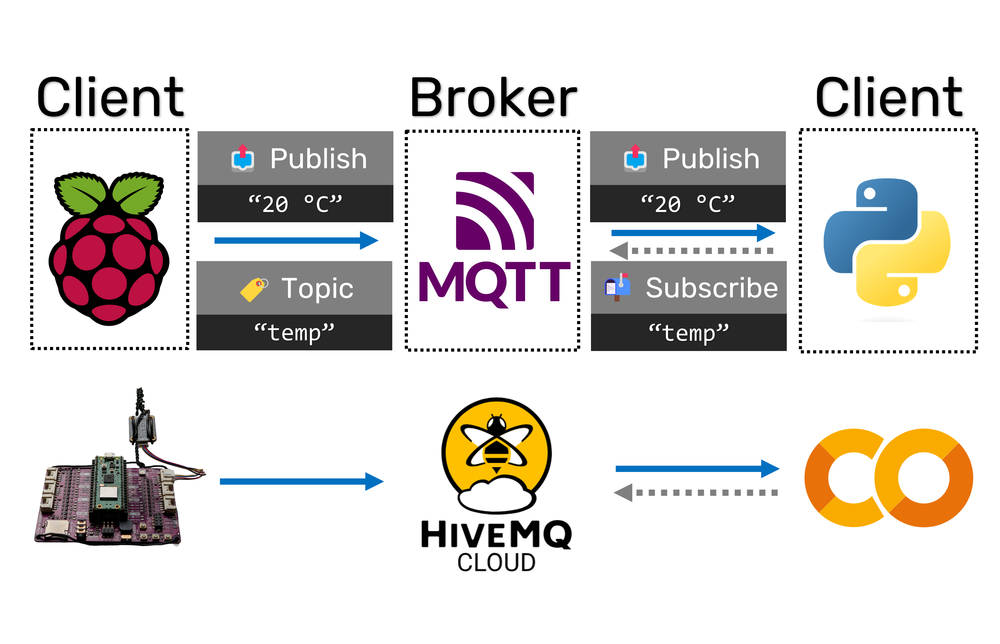

# 🧩 1.4 Device Communication

% ```{rubric} 🧩 1.4 Device Communication
% ```

```{contents}
:depth: 2
```

## 🔰 Tutorial

```{include} ./mqtt-warning.md
```

In this tutorial, you will learn how to send commands to and receive sensor data from a microcontroller using the MQTT protocol.



*Workflow diagram of using a MQTT broker with the "publish/subscribe" model to pass temperature data from one client to another.*

<!-- ## HiveMQ Broker Setup

✅ If you haven't already, **follow Step 13b in the Software setup section of the Build Instructions manuscript** [🔗 DOI: 10.1016/j.xpro.2023.102329](https://doi.org/10.1016/j.xpro.2023.102329) (pages 11-12 in the PDF) to create your own HiveMQ cluster and security certificate. This is necessary to complete this module's GitHub Classroom assignment. -->

### Onboard LED using MQTT

In an earlier module (blink and read), you learned how to blink the onboard LED every two seconds. In this section, you will control the onboard LED using MQTT, a standard protocol for internet-of-things communication. By definition, hardware/software communication implies that you are interfacing multiple devices (in this case, your microcontroller and a Jupyter notebook running on e.g., Google Colab). Let's start with a hands-on example.

✅ Create a new file on your Pico W microcontroller called `mqtt_led.py` and copy the script below (based on [JayPalm's gist](https://gist.github.com/JayPalm/8bfd836b696c28ec5dc1f6b5b4dd18ea) and [`mqtt_as` README](https://github.com/peterhinch/micropython-mqtt/blob/master/README.md)). Ensure that your microcontroller has been set up according to the instructions in the "Running the demo" module earlier in the course (only [`netman.py`](https://github.com/sparks-baird/self-driving-lab-demo/blob/main/src/public_mqtt_sdl_demo/lib/netman.py) [[permalink](https://github.com/sparks-baird/self-driving-lab-demo/blob/0ff0adec3e997c096990de594844d73a9ce18fd6/src/public_mqtt_sdl_demo/lib/netman.py)] and an appropriately filled-out `my_secrets.py` are required). You will also need to upload the [`mqtt_as.py` module](https://github.com/sparks-baird/self-driving-lab-demo/blob/045b276480d64bdd24287f427491041c33535ef2/src/public_mqtt_sdl_demo/lib/mqtt_as.py) to either the main directory or the `lib` folder. Make sure to replace `<your_id_here>` with your course ID (without the brackets). If you've forgotten your GitHub Classroom course ID, you can refer back to your quiz responses from the GitHub starter tutorial assignment. Once you've updated the file, save the file and click play.

`my_secrets.py`
```python
SSID = "Enter your SSID here"
PASSWORD = "Enter your WiFi password here"
HIVEMQ_USERNAME = "sgbaird"
HIVEMQ_PASSWORD = "D.Pq5gYtejYbU#L"
HIVEMQ_HOST = "248cc294c37642359297f75b7b023374.s2.eu.hivemq.cloud"
```

`mqtt_led.py`
```python
from mqtt_as import MQTTClient, config
from machine import Pin, ADC
import asyncio
from netman import connectWiFi
import ssl
import ntptime
from time import time

from my_secrets import (
    HIVEMQ_HOST,
    HIVEMQ_PASSWORD,
    HIVEMQ_USERNAME,
    PASSWORD,
    SSID,
)

connectWiFi(SSID, PASSWORD, country="US")

# usually would be a device-specific ID, but using course ID for now
COURSE_ID = "<your_id_here>"  # UPDATE THIS TO YOUR ID

# To validate certificates, a valid time is required
ntptime.timeout = 30  # type: ignore
ntptime.host = "pool.ntp.org"
ntptime.settime()

print("Obtaining CA Certificate")
# generated via https://colab.research.google.com/github/sparks-baird/self-driving-lab-demo/blob/main/notebooks/7.2.1-hivemq-openssl-certificate.ipynb # noqa: E501
with open("hivemq-com-chain.der", "rb") as f:
    cacert = f.read()
    f.close()

# Local configuration
config.update(
    {
        "ssid": SSID,
        "wifi_pw": PASSWORD,
        "server": HIVEMQ_HOST,
        "user": HIVEMQ_USERNAME,
        "password": HIVEMQ_PASSWORD,
        "ssl": True,
        "ssl_params": {
            "server_side": False,
            "key": None,
            "cert": None,
            "cert_reqs": ssl.CERT_REQUIRED,
            "cadata": cacert,
            "server_hostname": HIVEMQ_HOST,
        },
        "keepalive": 3600,
    }
)

onboard_led = Pin("LED", Pin.OUT)  # Pico W is slightly different than Pico

command_topic = f"{COURSE_ID}/onboard_led"
sensor_data_topic = f"{COURSE_ID}/onboard_temp"

adcpin = 4
sensor = ADC(adcpin)


def ReadTemperature():
    adc_value = sensor.read_u16()
    volt = (3.3 / 65535) * adc_value
    temperature = 27 - (volt - 0.706) / 0.001721
    # internal temp sensor has low precision, so round to 1 decimal place
    return round(temperature, 1)


async def messages(client):  # Respond to incoming messages
    async for topic, msg, retained in client.queue:
        try:
            topic = topic.decode()
            msg = msg.decode()
            retained = str(retained)
            print((topic, msg, retained))

            if topic == command_topic:
                if msg == "on":
                    onboard_led.on()
                elif msg == "off":
                    onboard_led.off()
                elif msg == "toggle":
                    onboard_led.toggle()
                temperature = ReadTemperature()
                print(f"Publish {temperature} to {sensor_data_topic}")
                # If WiFi is down the following will pause for the duration.
                await client.publish(sensor_data_topic, f"{temperature}", qos=1)
        except Exception as e:
            print(e)


async def up(client):  # Respond to connectivity being (re)established
    while True:
        await client.up.wait()  # Wait on an Event
        client.up.clear()
        await client.subscribe(command_topic, 1)  # renew subscriptions


async def main(client):
    await client.connect()
    for coroutine in (up, messages):
        asyncio.create_task(coroutine(client))

    start_time = time()
    # must have the while True loop to keep the program running
    while True:
        await asyncio.sleep(5)
        elapsed_time = round(time() - start_time)
        print(f"Elapsed: {elapsed_time}s")


config["queue_len"] = 2  # Use event interface with specified queue length
MQTTClient.DEBUG = True  # Optional: print diagnostic messages
client = MQTTClient(config)
del cacert  # to free memory
try:
    asyncio.run(main(client))
finally:
    client.close()  # Prevent LmacRxBlk:1 errors
```

After running the above script, you should see a message something like the following printed to the Thonny command line:

> ```
> MPY: soft reboot
> MAC address: <...>
> connected
> ip = <...>
> Obtaining CA Certificate
> Checking WiFi integrity.
> Got reliable connection
> Connecting to broker.
> Connected to broker.
> Elapsed: 10s
> Elapsed: 20s
> RAM free 119776 alloc 57504
> Elapsed: 30s
> ...
> ```

Then, navigate to the [companion Jupyter notebook](./1.4.1-onboard-led-temp.ipynb) and open it in a Jupyter IDE of your choice.

```{button-ref} ./1.4.1-onboard-led-temp
:color: primary
:expand:
Onboard LED and Temperature [Jupyter Notebook]
```

For your convenience, an "Open in Colab" link is provided. If you are running it elsewhere, you will need to manually install the `paho-mqtt` and `matplotlib` packages (i.e., `pip install paho-mqtt matplotlib`). Update it with your course ID and run the notebook. You should see a plot of the temperature data being sent from your microcontroller to the Jupyter notebook. You should also see the onboard LED on your microcontroller blinking every few seconds in response to the commands sent by the Jupyter notebook.

While there are simpler implementations of MQTT on a Pico W microcontroller, the current setup which uses [`micropython-mqtt`](https://github.com/peterhinch/micropython-mqtt) is secure, robust, resilient, and asynchronous. What this means is that:
1. All messages you send are encrypted and private (assuming you created your own HiveMQ instance)
2. Message delivery can be guaranteed
3. Receiving multiple messages in a short time frame is handled smoothly
4. The device automatically reconnects if WiFi gets spotty
5. The microcontroller's CPU resources are used efficiently via multi-tasking

For a hobbyist project, these might not be large concerns; however, when implementing an autonomous experimentation setup for research purposes, these are very important. Also keep in mind that much of this is "boilerplate code" that you can copy and paste into your own projects.

### How MQTT Works

✅ Read the following three pages from [this MQTT basics course](http://www.steves-internet-guide.com/mqtt-basics-course/):

- [How MQTT Works](http://www.steves-internet-guide.com/mqtt-works/)
- [Understanding MQTT Topics and Topic Structure](http://www.steves-internet-guide.com/understanding-mqtt-topics/)
- [MQTT Publishing, Subscribing, and Message Exchange](http://www.steves-internet-guide.com/mqtt-publish-subscribe/)

✅ Read [How to Use The Paho MQTT Python Client for Beginners](http://www.steves-internet-guide.com/into-mqtt-python-client/) from the [MQTT and Python For Beginners course](http://www.steves-internet-guide.com/mqtt-python-beginners-course/)

<!-- ✅ Read about the [Paho MQTT Python client](http://www.steves-internet-guide.com/receiving-messages-mqtt-python-client/). Pay attention to the section about using a `Queue` -->

✅ Review the [micropython-mqtt repository README](https://github.com/peterhinch/micropython-mqtt) and its [Asynchronous MQTT docs](https://github.com/peterhinch/micropython-mqtt/blob/master/README.md)

✅ Read [Receiving Messages with the Paho MQTT Python Client](http://www.steves-internet-guide.com/receiving-messages-mqtt-python-client/), paying special attention to the "Use the Queue object" section. Then read the Basic first-in first-out (FIFO) Queue section from [this page](https://pymotw.com/2/Queue/#basic-fifo-queue)

```{note}
In the microcontroller example from earlier, the Quality of Service (QoS) is set to 1. This is because the `micropython-mqtt` package only supports QoS 0 or 1. Trying to set `qos=2` on the microcontroller will result in an error. However, the QoS is set to 2 in the companion notebook. In this case, the lower of the two QoS's is used to deliver the message. See [key considerations for QoS in MQTT](https://www.hivemq.com/blog/mqtt-essentials-part-6-mqtt-quality-of-service-levels/#heading-what-are-the-key-considerations-for-qo-s-in-mqtt) for more information. In a complex autonomous laboratory and when message delivery time of a few seconds isn't a concern, specifying the highest allowable QoS reduces loss or repetition of messages and the corresponding burden on the implementer to deal with those cases.
```

### Additional Resources
- [How to Send and Receive Data Using Raspberry Pi Pico W and MQTT](https://www.tomshardware.com/how-to/send-and-receive-data-raspberry-pi-pico-w-mqtt)
- To better understand the `async` and `await` expressions in the code above, refer to [Make Your Microcontroller Multi-task With Asynchronous Programming](https://yiweimao.github.io/blog/async_microcontroller/)
- A simpler, less robust alternative to `mqtt_as`: [`micropython-umqtt.simple2` repository](https://github.com/fizista/micropython-umqtt.simple2)
- [HiveMQ's websocket client for MQTT testing](https://www.hivemq.com/demos/websocket-client/) (note that one is also available on your HiveMQ instance which can be used for your instance without as much setup)
- HiveMQ has [a free public broker and browser client](https://www.hivemq.com/mqtt/public-mqtt-broker/) than can be useful for debugging and troubleshooting
- Another popular MQTT framework is [Mosquitto](https://mosquitto.org/), which also has [a public (non-secure) broker](https://test.mosquitto.org/)

### Alternative Frameworks

MQTT is only one of many good protocols that can be used for hardware/software communication. Other popular protocols, especially in the context of laboratory information, include:
- [Robot Operating System (ROS)](https://www.ros.org/)
- [SiLA2](https://sila-standard.com/)
- [OPC Unified Architecture (OPC UA)](https://opcfoundation.org/about/opc-technologies/opc-ua/)

Workflow orchestration packages for laboratory automation are generally based on a standard communication protocol like MQTT and the ones mentioned above.

See also https://github.com/AccelerationConsortium/awesome-self-driving-labs#software.

<!-- - https://core-electronics.com.au/guides/getting-started-with-mqtt-on-raspberry-pi-pico-w-connect-to-the-internet-of-things/#setup -->
<!-- - https://peppe8o.com/mqtt-and-raspberry-pi-pico-w-start-with-mosquitto-micropython/ -->
<!-- - https://www.hivemq.com/article/mqtt-client-library-paho-python/ -->
<!-- - [Getting started with your Raspberry Pi Pico W](https://projects.raspberrypi.org/en/projects/get-started-pico-w) -->
<!-- https://www.hivemq.com/article/how-to-get-started-with-mqtt/ -->
<!-- https://www.youtube.com/watch?v=r89uHL2wj5Q&list=PLRkdoPznE1EMXLW6XoYLGd4uUaB6wB0wd&index=2 -->
<!-- https://mqtt.org/getting-started/ -->
<!-- http://www.steves-internet-guide.com/mqtt-works/ -->
<!-- http://www.steves-internet-guide.com/receiving-messages-mqtt-python-client/ -->
<!-- [How To Set Up MQTT With Raspberry Pi Pico W | Guide For Beginners](https://www.youtube.com/watch?v=ybCMXqsQyDw) -->
<!-- https://www.instructables.com/Connecting-Raspberry-Pi-Pico-Ws-With-MQTT/ -->
<!-- https://github.com/peterhinch/micropython-mqtt/issues/100 -->
<!-- https://forum.micropython.org/viewtopic.php?f=18&t=11906#p65746 -->
<!-- https://github.com/peterhinch/micropython-mqtt/issues/94 -->
<!-- http://www.steves-internet-guide.com/into-mqtt-python-client/ -->

## 🚀 Quiz

::::{tab-set}
:sync-group: category

:::{tab-item} W 2024
:sync: w2024

https://q.utoronto.ca/courses/350933/assignments/1274179?display=full_width
:::

:::{tab-item} Sp/Su 2024
:sync: sp2024

https://q.utoronto.ca/courses/351407/assignments/1286932?display=full_width
:::

::::

## 📄 Assignment

::::{tab-set}
:sync-group: category

:::{tab-item} W 2024
:sync: w2024

https://q.utoronto.ca/courses/350933/assignments/1274180?display=full_width
:::

:::{tab-item} Sp/Su 2024
:sync: sp2024

https://q.utoronto.ca/courses/351407/assignments/1286933?display=full_width
:::

::::
