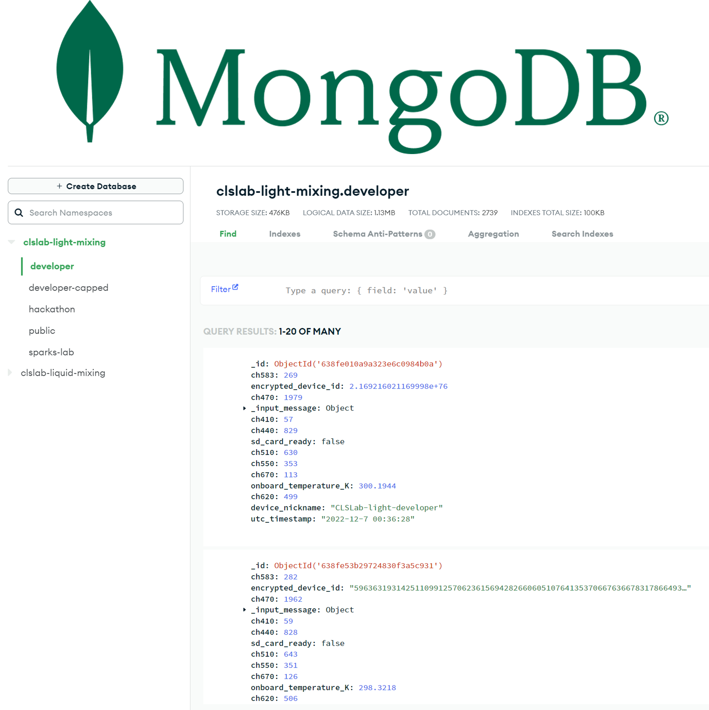
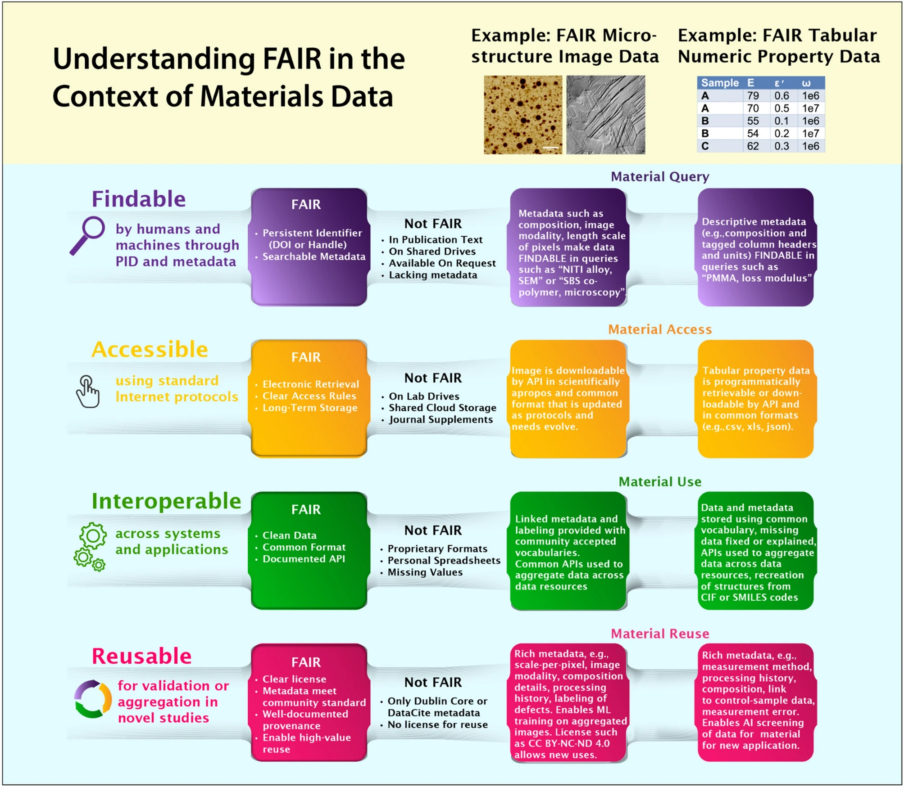

# 🧩 1.5 Logging Data

% ```{rubric} 🧩 1.5 Logging Data
% ```

```{contents}
:depth: 3
```

## 🔰 Tutorial

In this tutorial, you will learn how to upload data to a MongoDB database from a microcontroller and read data from a database using Python.



*MongoDB database interface for a light-mixing database instance.*

### FAIR Data

Chemistry and materials research data is precious. By making your data **F**indable, **A**ccessible, **I**nteroperable, and **R**eusable ([FAIR](https://www.go-fair.org/fair-principles/)), you can maximize the impact of your research. Here are two conceptual examples of what FAIR data might look like in the physical sciences:



*Defining FAIR Data in materials science. Reproduced from https://doi.org/10.1557/s43577-023-00498-4*

### Writing to MongoDB Using the Data API

For storing our data, we will be using [MongoDB](https://www.mongodb.com/), a popular ["NoSQL"](https://www.mongodb.com/nosql-explained) database. It's important to note that MongoDB is just one of many excellent choices for databases (e.g., [PostgreSQL](https://www.postgresql.org/) for relational databases, which can be [hosted via AWS](https://aws.amazon.com/rds/postgresql/), and [Neo4j](https://neo4j.com/) for graph-based databases). MongoDB is a document-oriented database, which means it stores data in JSON-like documents. MongoDB is a popular choice for internet-of-things (IoT) applications due to its ease of setup, use, and scalability. Unfortunately, MongoDB Atlas suddenly deprecated their [Data API](https://docs.atlas.mongodb.com/data-api/) that allowed for direct reading and writing of data from devices like microcontrollers. Instead, we'll use something called AWS Lambda as an intermediary. AWS Lambda is a serverless compute service that lets you run code without provisioning or managing servers. It's a nice choice for creating lightweight APIs and handling intermittent requests, which works well for our microcontroller application.

For the purposes of this tutorial, we have set up a free-tier test database through MongoDB Atlas and an AWS Lambda function. We provide the necessary credentials which would normally be kept private. To prevent potential misuse from distributing a public API key (which is generally not a good practice), we have granted only write permissions for this tutorial, and the database is configured to automatically delete entries once a certain storage threshold is reached. The [companion notebook](./1.5.1-pymongo.ipynb) has a similar setup, where only read permissions are granted.

✅ Copy the following code into a new file on the microcontroller called `write_mongodb.py` and run the file. Note that you will need [`netman.py`](https://github.com/sparks-baird/self-driving-lab-demo/blob/main/src/public_mqtt_sdl_demo/lib/netman.py) [[permalink](https://github.com/sparks-baird/self-driving-lab-demo/blob/0ff0adec3e997c096990de594844d73a9ce18fd6/src/public_mqtt_sdl_demo/lib/netman.py)] and a file named `my_secrets.py` with your WiFi credentials, course ID, and Lambda function URL.

`my_secrets.py`
```python

```

https://docs.aws.amazon.com/lambda/latest/dg/urls-invocation.html
https://medium.com/@g.bharthvajan/create-simple-get-post-rest-api-with-aws-lambda-function-url-7fa962197fa8

https://stackoverflow.com/questions/63310567/access-json-request-from-python-in-python-aws-lambda-function

https://docs.aws.amazon.com/lambda/latest/dg/python-handler.html

`write_mongodb.py`
```python
import requests
import json

url = "https://p68yzl6gu6.execute-api.us-west-1.amazonaws.com/test/helloworld"

headers = {"course_id": "sassy-robin"}

response = requests.post(url, json=headers)

print(response.text)
```

```python
import json


def lambda_handler(event, context):
    body = json.loads(event["body"])
    return {"statusCode": 200, "body": json.dumps(body)}
```


```python
# based on https://medium.com/@johnlpage/introduction-to-microcontrollers-and-the-pi-pico-w-f7a2d9ad1394
from netman import connectWiFi
import urequests

from my_secrets import SSID, PASSWORD, COURSE_ID

connectWiFi(SSID, PASSWORD, country="US")

DATA_API_KEY = "UT4cdinBetBaNqCBc5hISkaArhllv5dWfzXgbYsLYzpv79nqNhVwVsudQU5ZUmBE"  # Public API key for demo purposes only
CLUSTER_NAME = "test-cluster"
DATABASE_NAME = "test-db"
COLLECTION_NAME = "write-to-me"

ENDPOINT_BASE_URL = (
    "https://us-east-2.aws.data.mongodb-api.com/app/data-ibmqs/endpoint/data/v1"
)

endpoint_url = f"{ENDPOINT_BASE_URL}/action/insertOne"

headers = {"api-key": DATA_API_KEY}
document = {"course_id": COURSE_ID}

payload = {
    "dataSource": CLUSTER_NAME,
    "database": DATABASE_NAME,
    "collection": COLLECTION_NAME,
    "document": document,
}

print(f"sending document to {CLUSTER_NAME}:{DATABASE_NAME}:{COLLECTION_NAME}")

num_retries = 3
for _ in range(num_retries):
    response = urequests.post(endpoint_url, headers=headers, json=payload)
    txt = str(response.text)
    status_code = response.status_code

    print(f"Response: ({status_code}), msg = {txt}")

    response.close()

    if status_code == 201:
        print("Added Successfully")
        break

    print("Retrying...")
```

The output should look something like the following (MAC address and IP address redacted, and your insertedId will be different):

> ```python
> MAC address: ***
> connected
> ip = ***
> sending document to test-cluster:test-db:write-to-me
> Response: (201), msg = {"insertedId":"6594bfbfb3c925d2fdfbb7e8"}
> Added Successfully
> ```

### Reading from MongoDB Using PyMongo

✅ Run the code from [the companion notebook](./1.5.1-pymongo.ipynb) to read data from a MongoDB database. Note that this also has a section about how to upload data via PyMongo (preferred when you're able to install PyMongo on e.g., a Raspberry Pi 5 or a Windows machine, which wasn't possible for the Pico W microcontroller).

<!-- ✅ Copy the following code into a new file called `read_mongodb.py` and run it on the microcontroller. -->

### Reading Material

✅ Read [Community action on FAIR data will fuel a revolution in materials research](https://doi.org/10.1557/s43577-023-00498-4)

✅ Watch [the following video](https://youtu.be/cdSENQPsAiI?si=KkwmGzoQmQP-CsQo) about materials databases:

<iframe width="560" height="315" src="https://www.youtube.com/embed/cdSENQPsAiI?si=h1dw65aA1tNamyQV" title="YouTube video player" frameborder="0" allow="accelerometer; autoplay; clipboard-write; encrypted-media; gyroscope; picture-in-picture; web-share" allowfullscreen></iframe>

### Additional Resources
- FAIR data principles [website](https://www.go-fair.org/fair-principles/) and [manuscript](https://doi.org/10.1038/sdata.2016.18)
- [MongoDB: What is NoSQL?](https://www.mongodb.com/nosql-explained)
- [MongoDB Getting Started Interactive Tutorial](https://www.mongodb.com/docs/manual/tutorial/getting-started/)
- [PostgreSQL](https://www.postgresql.org/), a popular open-source relational database which can be [hosted via AWS](https://aws.amazon.com/rds/postgresql/)
- [Neo4j](https://neo4j.com/), a popular graph-based database
- [@sgbaird's list of materials databases](https://github.com/stars/sgbaird/lists/materials-databases)
- Misc. [`awesome-materials-informatics`](https://github.com/tilde-lab/awesome-materials-informatics) (search for "database"), [`Materials-Databases` (no longer maintained)](https://github.com/blaiszik/Materials-Databases), [`awesome-chemistry-datasets`](https://github.com/kjappelbaum/awesome-chemistry-datasets)
- [`awesome-self-driving-labs` research data management section](https://github.com/AccelerationConsortium/awesome-self-driving-labs#research-data-management)

As a side note, MongoDB has a "serverless" option (i.e., pay only for what you use) that exceeds the free-tier limits and is more flexible than the shared and dedicated clusters, which may seem appealing at first. HOWEVER, [costs will escalate quickly if the database is not optimized](https://www.mongodb.com/developer/products/atlas/serverless-instances-billing-optimize-bill-indexing/) (e.g., the database is not indexed). If you decide to go with MongoDB Atlas for a project and need more than the 512 MB of free-tier storage, we recommend first considering the shared (e.g., M2, M5) and dedicated options, hosting your own MongoDB instance, or looking to other ecosystems. Beware of serverless. Looking to other ecosystems could be either a full replacement or a supplement (e.g., using AWS for storing large files and adding links to those files into MongoDB).

```{tip}
Upload larger files to [Amazon S3](https://docs.aws.amazon.com/AmazonS3/latest/userguide/Welcome.html) and store the universal resource identifier (URI) in MongoDB.

For example, let's say that one step in your workflow involves capturing images, where the total storage required is on the order of GBs instead of MBs. Instead of saving your images directly to MongoDB (e.g., using [GridFS or the `BinData` type](https://www.mongodb.com/docs/manual/core/gridfs/)), you can upload your image to [Amazon S3](https://docs.aws.amazon.com/AmazonS3/latest/userguide/Welcome.html) or similar and add the URI to the corresponding MongoDB document along with other data like sample name, image acquisition parameters, material composition, and processing conditions. The URI can then later be used to [programatically access the file from Amazon S3](https://chat.openai.com/share/4ec06c80-8915-4b21-9b3c-4e7a9abb186a).

For an example, see [`ac_training_lab/A1-cam/server.py`](https://github.com/AccelerationConsortium/ac-training-lab/blob/main/src/ac_training_lab/A1-cam/server.py).
```

## 🚀 Quiz

::::{tab-set}
:sync-group: category

:::{tab-item} W 2024
:sync: w2024

https://q.utoronto.ca/courses/350933/assignments/1274181?display=full_width
:::

:::{tab-item} Sp/Su 2024
:sync: sp2024

https://q.utoronto.ca/courses/351407/assignments/1286934?display=full_width
:::

::::

## 📄 Assignment

::::{tab-set}
:sync-group: category

:::{tab-item} W 2024
:sync: w2024

https://q.utoronto.ca/courses/350933/assignments/1274182?display=full_width
:::

:::{tab-item} Sp/Su 2024
:sync: sp2024

https://q.utoronto.ca/courses/351407/assignments/1286935?display=full_width
:::

::::
