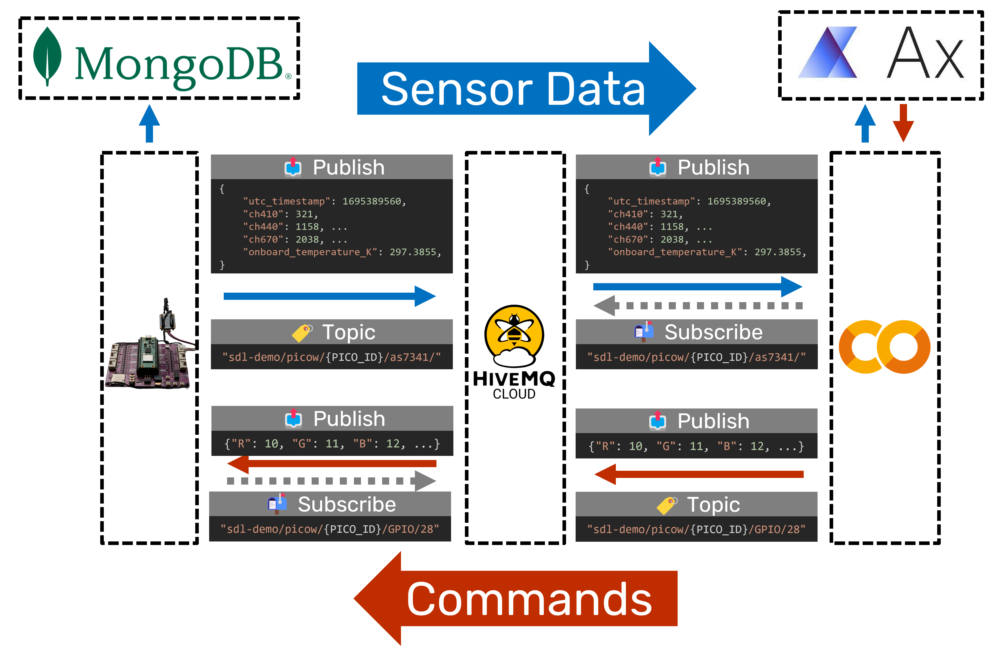

# 🧩 1.6 Connecting the Pieces

% ```{rubric} 🧩 1.6 Connecting the Pieces
% ```

```{contents}
:depth: 2
```

## 🔰 Tutorial

```{warning}
As a temporary workaround to the issue described in https://github.com/orgs/micropython/discussions/15112, add [`urequests_2.py`](https://github.com/AccelerationConsortium/ac-microcourses/blob/main/docs/courses/hello-world/urequests_2.py) [[permalink](https://github.com/AccelerationConsortium/ac-microcourses/blob/e5541ce3ec307a8e5e0f2b20f000c03f040e1f56/docs/courses/hello-world/urequests_2.py)] to your microcontroller, and change `import urequests` to `import urequests_2 as urequests` in the code below. See https://github.com/orgs/micropython/discussions/15112 and https://github.com/micropython/micropython-lib/pull/861 for ongoing updates. The corresponding assignment will also be affected, but this can be addressed using the same workaround.
```

```{include} ./mqtt-warning.md
```

You've made it to the final module of this microcourse! Well done 🥳. In this module, you will connect the pieces from previous modules into the "Hello World" of self-driving labs, from microcontroller programming and Bayesian optimization to hardware-software communication and data logging.



*Workflow diagram showing how core pieces connect together in the "Hello World" light-mixing demo.*

✅ Review the [course overview](./overview.md) to see how this module fits into the overall course structure

✅ Review the tutorials from the earlier modules. Direct links to the tutorial pages are copied here for convenience:

1. [Running the demo](./1.1-running-the-demo)
2. [Blink and read](./1.2-blink-and-read)
3. [Bayesian optimization](./1.3-bayesian-optimization)
4. [Hardware-software communication](./1.4-hardware-software-communication)
5. [Data logging](1.5-data-logging)

✅ Review the knowledge checks via the main course website

✅ Review your assignment repositories. For quick access, see [your ACC-HelloWorld GitHub organization repositories](https://github.com/orgs/ACC-HelloWorld/repositories).

<!-- resources from earlier, specifically: -->

<!-- ## Pre-built demo
- [video tutorial](https://youtu.be/D54yfxRSY6s)
- [🔗 DOI: 10.1016/j.xpro.2023.102329](https://doi.org/10.1016/j.xpro.2023.102329)
- [🔗 DOI: 10.1016/j.matt.2022.11.007](https://doi.org/10.1016/j.matt.2022.11.007)

## Microcontroller programming
- [NeoPixel MicroPython documentation](https://docs.micropython.org/en/latest/esp8266/tutorial/neopixel.html)
- [`as7341_sensor` MicroPython Module](https://github.com/sparks-baird/self-driving-lab-demo/blob/7b9a2a9bc4a5079b03907ffd5c758094217d3872/src/public_mqtt_sdl_demo/lib/as7341_sensor.py)

## Bayesian Optimization
- [Service API tutorial (Google Colab)](./1.3.1-ax-service-api.ipynb) -->

## 🚀 Quiz

::::{tab-set}
:sync-group: category

:::{tab-item} W 2024
:sync: w2024

https://q.utoronto.ca/courses/350933/assignments/1274183?display=full_width
:::

:::{tab-item} Sp/Su 2024
:sync: sp2024

https://q.utoronto.ca/courses/351407/assignments/1286936?display=full_width
:::

:::{tab-item} Sp/Su 2025
:sync: sp2025

https://q.utoronto.ca/courses/367721/assignments/1499680?display=full_width
:::

::::

## 📄 Assignment

::::{tab-set}
:sync-group: category

:::{tab-item} W 2024
:sync: w2024

https://q.utoronto.ca/courses/350933/assignments/1274184?display=full_width
:::

:::{tab-item} Sp/Su 2024
:sync: sp2024

https://q.utoronto.ca/courses/351407/assignments/1286937?display=full_width
:::

:::{tab-item} Sp/Su 2025
:sync: sp2025

https://q.utoronto.ca/courses/367721/assignments/1499681?display=full_width
:::

::::

## Course Completion

For those who have completed the course, thank you for your participation, and congratulations! 🥳

Once you have completed all the modules, fill out the [Certificate of Completion Request form](https://learn.utoronto.ca/help/forms-and-applications/confirmation-completion-request) through the School of Continuing Studies to receive your microcredential. This process may take up to 4-6 weeks. As a reminder, 70% is the required threshold to pass.

Please also consider filling out [the final course evaluation form](https://forms.office.com/pages/responsepage.aspx?id=JsKqeAMvTUuQN7RtVsVSED10bCjLqktHgL2RqBGcPihUQjU4NFg3SFlWRzVGMUlDNVlZWjBJRjNGTy4u&route=shorturl) listed on your course syllabus as well as [the learner equity survey](https://redcap.utoronto.ca/surveys/?s=77R3YNHDHX3TKRLD).

Once you have received your microcredential, consider adding the corresponding badge your LinkedIn profile to promote your accomplishment. Likewise, we would love to see a social media post from you using the `#AcMicrocourses` hashtag with the Acceleration Consortium account tagged ([`@acceleration-consortium`](https://www.linkedin.com/company/acceleration-consortium/) for LinkedIn and [`@acceleration_c`](https://x.com/acceleration_c) for X).
