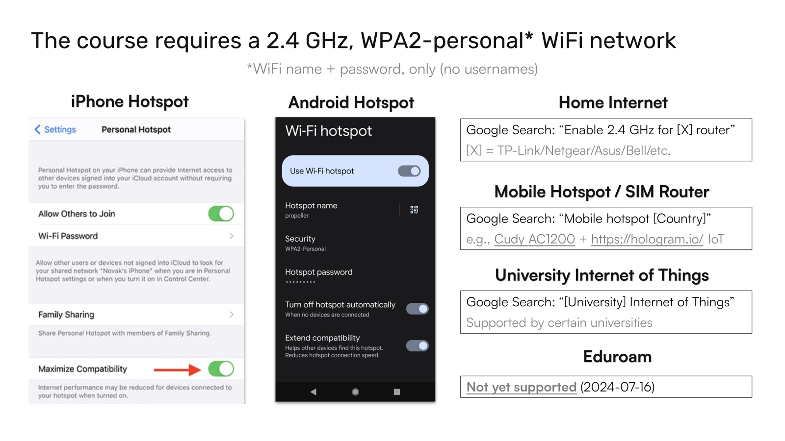

```{warning}
This course requires physical hardware and a 2.4 GHz WPA2-Personal wireless network
```

If you do not have the hardware, you will need to purchase [the required components](https://www.digikey.com/short/3m5nn9vn), replacing the USB power adapter with the correct style for your country (e.g., [European type C](https://www.digikey.de/en/products/detail/cui-inc/SWI5-5-E-I38/5287193)), if necessary. You may also refer to ["Before you Begin"](https://www.sciencedirect.com/science/article/pii/S2666166723002964?via%3Dihub#sec1).


```{tip}
If the AS7341 sensor shows as being on backorder, you can either order it from DigiKey still and wait until it comes back in stock or source it from another supplier (see e.g., [Adafruit's listing](https://www.adafruit.com/product/4698), [Mouser](https://www.mouser.com/ProductDetail/Adafruit/4698?qs=DPoM0jnrROVDX4DJc6qcFQ%3D%3D)). If you have trouble accessing the DigiKey cart, see the [CSV version of the cart](https://github.com/sparks-baird/self-driving-lab-demo/blob/main/reports/light-mixing-demo-digikey-cart.csv) [[permalink](https://github.com/sparks-baird/self-driving-lab-demo/blob/ebeea92ee16e38e8e129b89b6ef7fb961a800503/reports/light-mixing-demo-digikey-cart.csv)].
```

You will need access to a 2.4 GHz WPA2-personal wireless network (i.e., WiFi name and password only, without usernames, which is required for most internet-of-things devices). If you do not already have access to one, some alternatives include setting up a home network to broadcast both 2.4 GHz and 5 GHz networks per your router's specific instructions, or perhaps easier - using a mobile hotspot in extended compatibility mode. Likewise, you may also use a SIM-enabled router or check if your organization supports IoT devices. Eduroam is [not yet supported](https://raspberrypi.stackexchange.com/questions/139096/how-can-i-connect-my-raspberry-pi-pico-w-to-an-eduroam-wifi-access-point-wpa-au) as of 2024-07-16. See [additional recommendations](https://github.com/sparks-baird/self-driving-lab-demo/discussions/83) for gaining access to the required network.



```{tip}
If you need a quick solution that can be standalone and dedicated, we have tested the [Cudy AC1200 SIM-enabled Router](https://www.amazon.com/Cudy-Unlocked-1200Mbps-EC25-AFX-Cloudflare/dp/B089JW8H4N) with a [Hologram IoT SIM Card](https://store.hologram.io/products/single-core-global-euicc-iot-sim-card) and [pay-as-you-go plan](https://www.hologram.io/pricing/), though pay-as-you-go data is expensive at US\$100/GB (US\$0.10/MB) and intended for low-bandwidth data transfer.
```
