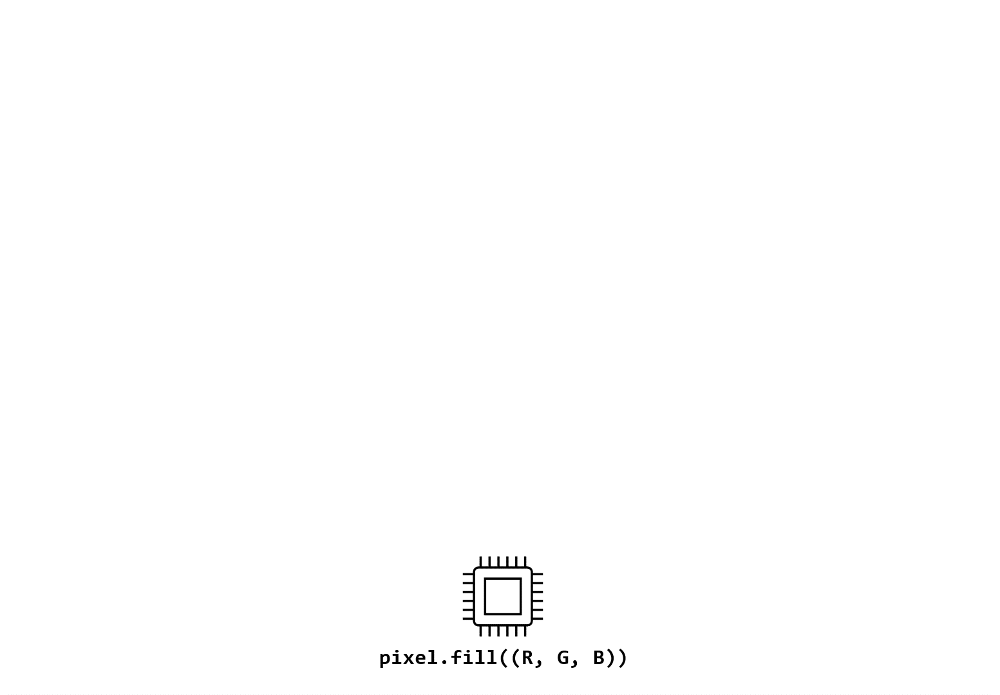

<!--- WARNING: THIS IS AN AUTO-GENERATED FILE. DO NOT EDIT DIRECTLY. Instead, edit
in docs/course-data.yaml and run the `scripts/generate_overviews.py` file. --->

# 💡 Introduction to AI for Discovery using Self-driving Labs


```{note} Registration for this course is LIVE! Register [here](https://learn.utoronto.ca/programs-courses/courses/4010-introduction-ai-discovery-using-self-driving-labs). If you're already registered, your course will be available at https://q.utoronto.ca/.
```


Self-driving laboratories (SDLs) incorporate AI and automation into scientific laboratories to speed up the discovery of new materials for applications such as clean energy and cancer drugs. Discover the essential principles of SDLs by building a 'Hello World' SDL from scratch. In this asynchronous, remote course, you will build a self-driving color matcher using dimmable LEDs and a light sensor. This introduction will help you implement hardware/software communication, database integration, microcontroller programming, and Bayesian optimization. Each of these are important components of an SDL, and you will get a taste of these in the course modules. In the final module, you will piece together the individual components to create your very own SDL demo. This introductory course will prepare you for deeper dives in data science, robotics, software development, and system design in later microcourses.


Animated schematic diagram of the 'Hello World' demo: A microcontroller controls the LEDs and reads sensor data. The difference between the target color and the measured color is fed into an adaptive experimentation algorithm, and the process repeats itself.

## 🔑 Recommended Prerequisites


```{include} ./hardware-note.md
```

For participants to complete this course within the expected timeframe (approx. 25 hours), at least beginner proficiency in Python programming is recommended. Those with advanced programming expertise will likely require a significantly shorter amount of time, whereas those with no prior programming experience may require 50 hours or more.


## 🎯 Learning Outcomes


- Define and explain key terms and principles of self-driving labs to demonstrate understanding
- Apply MQTT or similar frameworks to send commands and receive sensor data over WiFi
- Demonstrate the ability to use MongoDB to store and retrieve experiment configurations and results effectively
- Develop and implement software on a Raspberry Pi Pico W microcontroller to control device power and read sensor data accurately
- Modify a Bayesian optimization script using the Ax Platform to iteratively propose new experimental configurations
- Integrate the individual SDL components to orchestrate the full 'Hello World' workflow

## 🛠️ Competencies/Skills


- Basic self-driving lab literacy
- Microcontrollers and sensors
- Bayesian optimization
- Hardware/software communication
- Database management
- Workflow orchestration

## 🧩 Modules

The orientation modules are intended to be completed in under one hour in total. The modules after are intended to take approximately 3-4 hours each, assuming that the recommended prerequisites from above have been met.

```{list-table}
:header-rows: 1

* - Module Name
  - Topics
  - Learning Outcomes

* - 0. Orientation
  - * Git
    * GitHub
    * Version control
    * GitHub Classroom
    * Codespaces
  - * Describe the purpose of Git and GitHub
    * Create a GitHub account and a repository
    * Commit, push, and pull changes
    * Run a unit test and fix a simple Python function
    * Define continuous integration

* - 1. Running the SDL demo
  - * Database management
    * Bayesian optimization
    * Microcontrollers
  - * Describe key terms and principles of self-driving labs
    * Preview an end-to-end self-driving lab
    * Upload software to a microcontroller

* - 2. Blink and Read
  - * Microcontrollers
    * MicroPython
  - * Write MicroPython scripts
    * Use a microcontroller

* - 3. Bayesian optimization
  - * Design of experiments
    * Bayesian optimization
    * Data visualization
  - * Adapt a Bayesian optimization script to perform color-matching
    * Compare Bayesian optimization with other search methods
    * Visualize optimization efficiency

* - 4. Device communication
  - * MQTT
    * Broker/client
  - * Send commands to a microcontroller
    * Receive sensor data from a microcontroller

* - 5. Data logging
  - * MongoDB
    * Database management
  - * Set up a MongoDB account and database
    * Upload data directly from microcontroller
    * Extract and collate data from database

* - 6. Module integration
  - * Systems design
  - * Describe how individual components of an SDL can be integrated
    * Perform system-level debugging and troubleshooting
    * Conduct a full SDL experimental campaign

```

## ⚖️ Course Assessments and Grading Schema

<p>Each student is required to complete various quizzes and GitHub Classroom assignments. The course is structured into an orientation module followed by six subsequent modules. The course is graded on a pass/fail basis with 70% as the threshold for passing. Here is the breakdown of the points for each part of the course:</p><ul><li>🧭 Orientation Module: Worth 15 points.</li><li>📚 Modules 1-6: Each includes:<ul><li>🧭 A guided notebook tutorial (ungraded)</li><li>📓 A knowledge check (graded, 5 points)</li><li>🛠️ A GitHub Classroom assignment (graded, 10 points*)</li></ul></li></ul><p>*The final module's GitHub Classroom assignment is worth 30 points.</p><p>Note that partial points are available on certain assignments.</p>

## 👤 Course developer(s)


- Sterling Baird, PhD Materials Science and Engineering (Acceleration Consortium)


<div align="center">

[⬅️ Return to list of microcourses](../../index.md#microcourses)

</div>
