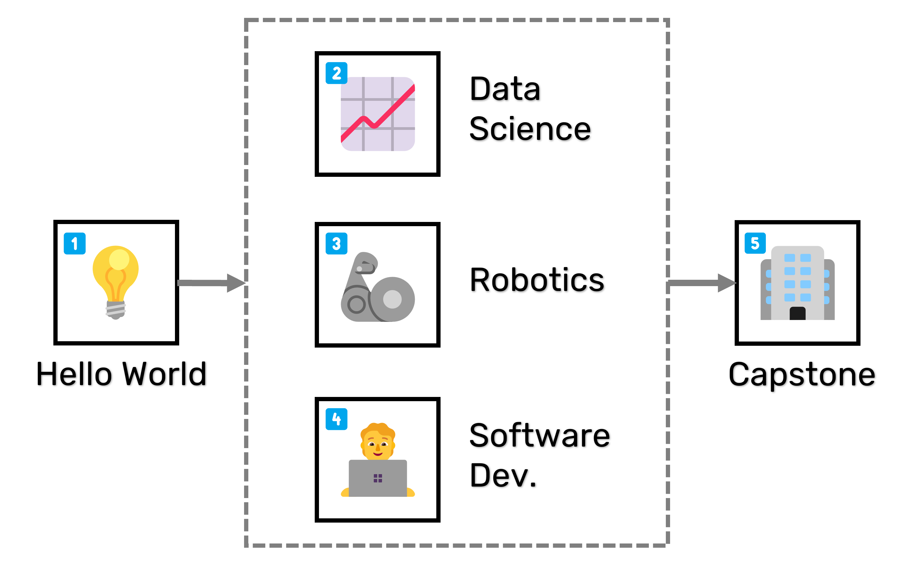

<!--  -->

# 📜 Autonomous Systems for Discovery

<a class="github-button" href="https://github.com/AccelerationConsortium/ac-microcourses"
data-icon="octicon-star" data-size="large" data-show-count="true" aria-label="Star
AccelerationConsortium/ac-microcourses on GitHub">Star</a>
<a class="github-button"
href="https://github.com/AccelerationConsortium" data-size="large" data-show-count="true"
aria-label="Follow @AccelerationConsortium on GitHub">Follow @AccelerationConsortium</a>
<a class="github-button"
href="https://github.com/sgbaird" data-size="large" data-show-count="true"
aria-label="Follow @sgbaird on GitHub">Follow @sgbaird</a>
<a class="github-button" href="https://github.com/AccelerationConsortium/ac-microcourses/issues"
data-icon="octicon-issue-opened" data-size="large" data-show-count="true"
aria-label="Issue AccelerationConsortium/ac-microcourses on GitHub">Issue</a>
<a class="github-button" href="https://github.com/AccelerationConsortium/ac-microcourses/discussions" data-icon="octicon-comment-discussion" data-size="large" aria-label="Discuss AccelerationConsortium/ac-microcourses on GitHub">Discuss</a>

Advanced materials hold the potential to improve our lives and our world, but traditional methods of discovery are slow and expensive. "Self-driving" laboratories (SDLs) have the power to fast-track materials discovery by using AI and robotics to run lab experiments autonomously. State-of-the-art SDLs require interdisciplinary teams and skillsets that traditional degree-based programs do not provide. To address this gap, the [Acceleration Consortium @ University of Toronto](https://acceleration.utoronto.ca/) presents the *Autonomous Systems for Discovery* certificate containing short, hands-on courses that will provide familiarity with the terminology, principles, and tools of SDLs.


The certificate consists of five microcourses:

|  | Course Title | Learning Outcome | Registration Link | Students |
|--------|--------------|-------------|------------------| -------- |
| 💡    | [Introduction to AI for Discovery using Self-driving Labs](courses/hello-world/index.md) | Recreate a color-matching SDL from scratch using LEDs and a light sensor | [Register](https://learn.utoronto.ca/programs-courses/courses/4010-introduction-ai-discovery-using-self-driving-labs) | <span id="helloWorldStudentCount" class="student-count">Loading...</span> |
| 📈    | [AI and Materials Databases for Self-driving Labs](courses/data-science/index.md) | Write Python scripts to iteratively optimize materials and log results to a database | TBD | N/A |
| 🦾    | [Autonomous Systems for Self-driving Labs](courses/robotics/index.md) | Write Python scripts to control robots and orchestrate workflows | TBD | N/A |
| 🧑‍💻    | [Software Development for Self-driving Labs](courses/software-dev/index.md) | Leverage software development tools and implement best practices | TBD | N/A |
| 🏢    | [AC Training Lab Design Project](courses/capstone/index.md) | Develop, defend, and execute a project proposal | TBD | N/A |

The microcourses progress in three stages—introduction, deeper dives, and capstone—as shown below. Courses #1-#4 are fully remote and asychronous, and the final capstone course will be conducted in-person at the AC training lab, where participants will have access to both educational and research-grade equipment.



```{toctree}
:maxdepth: 3
:includehidden:
💡 Course 1: Hello World <courses/hello-world/index>
📈 Course 2: Data Science <courses/data-science/index>
🦾 Course 3: Robotics <courses/robotics/index>
🧑‍💻 Course 4: Software Dev. <courses/software-dev/index>
🏢 Course 5: Capstone Project <courses/capstone/index>
```
```{toctree}
:maxdepth: 1
Developer Resources <dev-resources>
```

[Sphinx]: http://www.sphinx-doc.org/
[Markdown]: https://daringfireball.net/projects/markdown/
[reStructuredText]: http://www.sphinx-doc.org/en/master/usage/restructuredtext/basics.html
[MyST]: https://myst-parser.readthedocs.io/en/latest/


<script async defer src="https://buttons.github.io/buttons.js"></script>

<script src="_static/fetch_student_count.js"></script>


<!--
```{toctree}
:maxdepth: 1
:hidden:

💡 Hello, World! <courses/hello-world/overview>
📈 Data Science <courses/data-science/overview>
🦾 Robotics <courses/robotics/overview>
🧑‍💻 Software Development <courses/software-dev/overview>
🏢 Design Project <courses/capstone/overview>
```
-->
