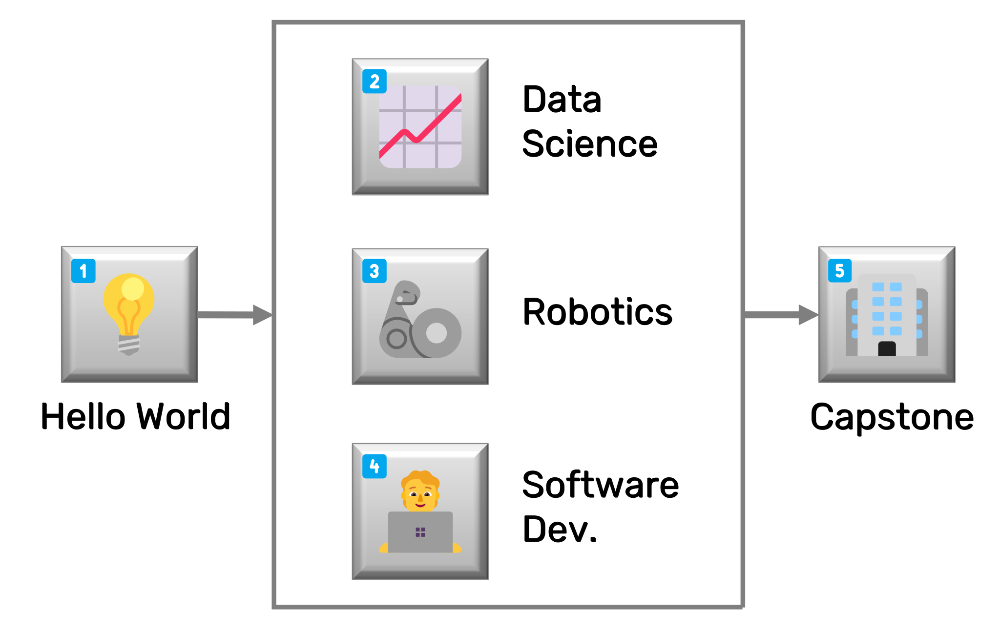

# 📜 Autonomous Systems for Discovery

<!--- Removed "Certificate" from title --->

```{warning}
This project is currently under development. If you would like to participate or are interested in contributing, please [introduce yourself and join the discussion](https://github.com/AccelerationConsortium/ac-microcourses/discussions/2).
```

While advanced materials hold the potential to improve our lives and our world, conventional methods of discovery are slow and expensive. "Self-driving" laboratories (SDLs) have the power to radically fast-track materials discovery—from an average of 20 years and \$100 million to as little as 1 year and \$1 million. This paradigm shift requires highly qualified personnel and multidisciplinary expertise. While extensive degree-based training can provide deep expertise in a single field, formal education options which provide needed cross-disciplinary skills are sparse. The [Acceleration Consortium @ University of Toronto](https://acceleration.utoronto.ca/) presents the *Autonomous Systems for Discovery* certificate to address this gap. This certificate contains a set of microcourses that introduces self-driving labs, provides deeper dives into data science, robotics, and software development, and facilitates a capstone project. Each course contains a series of hands-on guided tutorials and coding exercises for participants to adapt and apply what they've learned. This certificate will provide familiarity with the terminology, principles, and tools required for the highly interdisciplinary teams necessary to build state-of-the-art self-driving labs.

<!-- ```{note}
While the certificate option requires formal registration and tuition dues, the course content is made freely available.
``` -->

<!-- Alan's YouTube video, either here or as part of the Hello, World! course -->
<!-- description of the microcredentials, and the difference between the microcourse content and the microcredentials certificate -->

## 🎓 Microcourses

The *Autonomous Systems for Discovery* certificate consists of five core microcourses:

> 💡 Building a "Hello World" for self-driving labs<br>
> 📈 Data science for self-driving labs<br>
> 🦾 Robotics for self-driving labs<br>
> 🧑‍💻 Software development for self-driving labs<br>
> 🏢 Capstone project at the AC training lab


<!-- which participants will propose, develop, and defend a self-driving lab project. This will take place at the Acceleration Consortium's in-person training facility equipped with education- and research-grade equipment including liquid handlers, solid dispensers, Cartesian-axis systems, mobile robotic arms, a vertical lift module, and synthesis and characterization modules. -->

While the first four courses are fully remote and asychronous, the final capstone course will be conducted in-person at the AC training lab, where participants will have access to both educational and research-grade equipment.

<!-- link to the AC training lab page -->

<!-- :::{figure-md}


*Flowchart illustrating course progression for the Autonomous Systems for Discovery certificate*
::: -->

```{raw} html
:file: course-flowchart.svg
```
*Flowchart illustrating course progression for the Autonomous Systems for Discovery certificate*

<!-- SVG Instructions

I first created the SVG using PowerPoint. Note that I put 99% transparent white boxes in front of the spots I want to be clickable. Kind of hacky, but with minimal effect.

After opening within inkscape: click on object, right click, and select "Link Properties.." (or create link). Insert the relative link into the href field, e.g., courses/robotics/overview.html

Inside of SVG file exported from inkscape, replace:

   width="2922"
   height="1876"

with the following:

   viewBox="0 0 2922 1876"
   width="100%"
   height="100%"

See https://app.screencast.com/yIypgQZ22BO83

 -->

Upon completion of this certificate, you will be able to:

1. 💡 Recreate a color-matching self-driving lab from scratch using LEDs, a microcontroller, and a light sensor
2. 📈 Write Python scripts that use AI to iteratively suggest next experiments for advanced optimization tasks and store to a database
3. 🦾 Write Python scripts to control robots and orchestrate experimental and computational workflows
4. 🧑‍💻 Leverage state-of-the-art software development tools and implement best practices
5. 🏢 Develop, defend, and execute a project proposal for a self-driving lab

## 🗺️ Certificate Overview  <!-- alternative: 🔍 -->

👉 **First Step:** Start your journey by [**🔗 exploring the certificate overview**](certificate-framework.md). This is your roadmap to the microcourses, including title, description, prerequisites, learning outcomes, skills, modules, and assessment formats for each of the courses.

<!-- After clicking the link, use the navigation pane in the left sidebar to jump between content. -->

```{toctree}
:hidden:
:maxdepth: 2

🗺️ Certificate Overview <certificate-framework>
```

```{toctree}
:hidden:
:maxdepth: 2

📚 Course Content <course-content>
```

```{toctree}
:maxdepth: 2
:hidden:

🛠️ Developer Resources <dev-resources>
```

[Sphinx]: http://www.sphinx-doc.org/
[Markdown]: https://daringfireball.net/projects/markdown/
[reStructuredText]: http://www.sphinx-doc.org/en/master/usage/restructuredtext/basics.html
[MyST]: https://myst-parser.readthedocs.io/en/latest/


<!-- 1️⃣ 💡 Building a "Hello World" for self-driving labs<br>
2️⃣ 📈 Data science for self-driving labs<br>
3️⃣ 🦾 Robotics for self-driving labs<br>
4️⃣ 🧑‍💻 Software development for self-driving labs<br>
5️⃣ 🏢 Capstone project at the AC training lab -->


<!-- ```{toctree}
:maxdepth: 2

Contributions & Help <contributing>
License <license>
Authors <authors>
Changelog <changelog>
Module Reference <api/modules>
``` -->

<!-- * {ref}`genindex`
* {ref}`modindex`
* {ref}`search` -->


<!-- Perhaps use nested <details> to keep the content all within the index page -->

<!-- ## Additional Resources -->

<!-- 1. Use a database backend to programatically upload and retrieve materials data -->

<!-- Explore the course-level modules, topics, learning outcomes, and other info with the links below. After clicking one of the links, use the navigation pane in the left sidebar to jump between sections. -->


<!-- <br> -->

<!-- ## 🎯 Learning Outcomes -->


<!-- In the first course, participants will design and build a "Hello World" for self-driving labs using physical hardware and Python programming. The next three courses provide deeper dives into data science, robotics, and software development topics. These courses  will enable participants to iteratively suggest the next best experiment to perform, use a database backend to programatically upload and retrieve materials data, and orchestrate experimental and computational workflows. Likewise, participants will use software development tools and best practices to maximize efficiency and minimize frustration. The fifth and final course is a capstone project conducted in-person at the AC training lab, where participants will have access to both educational and research-grade equipment. -->


<!--  -->

<!-- ```{raw} html
<a href="certificate-framework.html"></a>
``` -->
