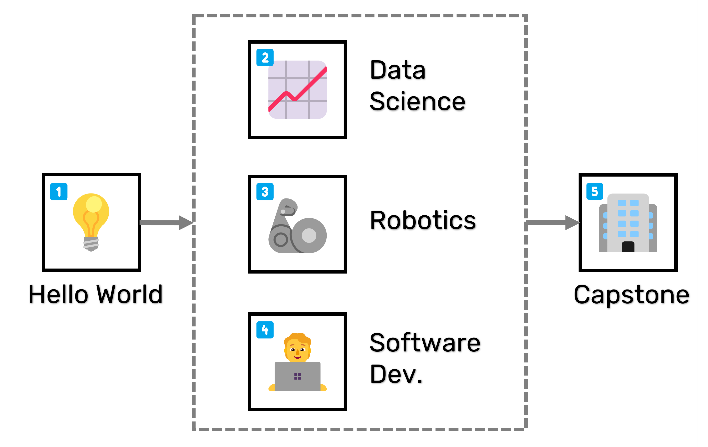

# 📜 Autonomous Systems for Discovery

```{warning}
This project is under development. If you would like to participate or are interested in contributing, please [introduce yourself](https://github.com/AccelerationConsortium/ac-microcourses/discussions/2) or reach out to [sterling.baird@utoronto.ca](mailto:sterling.baird@utoronto.ca).
```

Advanced materials hold the potential to improve our lives and our world, but traditional methods of discovery are slow and expensive. "Self-driving" laboratories (SDLs) have the power to fast-track materials discovery by using AI and robotics to run lab experiments autonomously. State-of-the-art SDLs require interdisciplinary teams and skillsets that traditional degree-based programs do not provide. To address this gap, the [Acceleration Consortium @ University of Toronto](https://acceleration.utoronto.ca/) presents the *Autonomous Systems for Discovery* certificate containing short, hands-on courses that will provide familiarity with the terminology, principles, and tools of SDLs.

<a class="github-button" href="https://github.com/AccelerationConsortium/ac-microcourses"
data-icon="octicon-star" data-size="large" data-show-count="true" aria-label="Star
AccelerationConsortium/ac-microcourses on GitHub">Star</a>
<a class="github-button"
href="https://github.com/AccelerationConsortium" data-size="large" data-show-count="true"
aria-label="Follow @AccelerationConsortium on GitHub">Follow</a>
<a class="github-button" href="https://github.com/AccelerationConsortium/ac-microcourses/issues"
data-icon="octicon-issue-opened" data-size="large" data-show-count="true"
aria-label="Issue AccelerationConsortium/ac-microcourses on GitHub">Issue</a>
<a class="github-button" href="https://github.com/AccelerationConsortium/ac-microcourses/discussions" data-icon="octicon-comment-discussion" data-size="large" aria-label="Discuss AccelerationConsortium/ac-microcourses on GitHub">Discuss</a>

<!-- ```{note}
While the certificate option requires formal registration and tuition dues, the course content is made freely available.
``` -->

<!-- Alan's YouTube video, either here or as part of the Hello, World! course -->
<!-- description of the microcredentials, and the difference between the microcourse content and the microcredentials certificate -->

## 🎓 Microcourses

The *Autonomous Systems for Discovery* certificate consists of five core microcourses and corresponding learning outcomes:

|  | Course Title | Learning Outcome |
|--------|--------------|-------------|
| 💡      | [Introduction to AI for Discovery using Self-driving Labs](../courses/hello-world/overview.md) | Recreate a color-matching SDL from scratch using LEDs and a light sensor |
| 📈      | [AI and Materials Databases for Self-driving Labs](../courses/data-science/overview.md) | Write Python scripts to iteratively optimize materials and log results to a database |
| 🦾      | [Autonomous Systems for Self-driving Labs](../courses/robotics/overview.md) | Write Python scripts to control robots and orchestrate workflows |
| 🧑‍💻      | [Software Development for Self-driving Labs](../courses/software-dev/overview.md) | Leverage software development tools and implement best practices |
| 🏢      | [AC Training Lab Design Project](../courses/capstone/overview.md) | Develop, defend, and execute a project proposal |

The microcourses progress in three stages—introduction, deeper dives, and capstone—as shown in the figure below. While the first four courses are fully remote and asychronous, the final capstone course will be conducted in-person at the AC training lab, where participants will have access to both educational and research-grade equipment.



```{toctree}
:maxdepth: 2

🗺️ Certificate Overview <../certificate-framework>
```

```{toctree}
:maxdepth: 2

📚 Course Content <../course-content>
```

```{toctree}
:maxdepth: 2

🛠️ Developer Resources <../dev-resources>
🌐 GitHub Source <https://github.com/AccelerationConsortium/ac-microcourses>
```

[Sphinx]: http://www.sphinx-doc.org/
[Markdown]: https://daringfireball.net/projects/markdown/
[reStructuredText]: http://www.sphinx-doc.org/en/master/usage/restructuredtext/basics.html
[MyST]: https://myst-parser.readthedocs.io/en/latest/


<script async defer src="https://buttons.github.io/buttons.js"></script>
